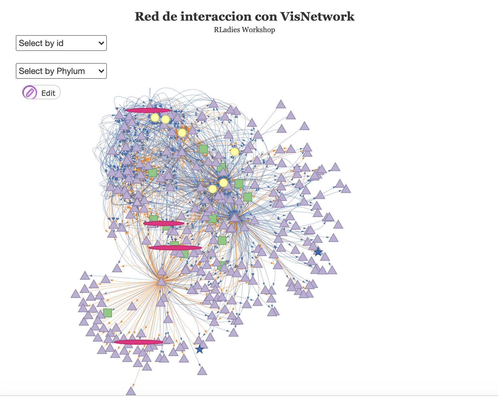

# Rladies


## Acerca de los datos

En este taller aprenderemos a utilizar la libreria de R [VisNetwork](https://datastorm-open.github.io/visNetwork/) que permite la visualización interactiva de redes. 

Utilizaremos datos reales descritos en [De Anda et al., 2018](https://www.frontiersin.org/article/10.3389/fmicb.2018.02606/full). Específicamente, la red biológica se obtuvo al caracterizar tapetes microbianos muestreados en el tiempo durante y después de una perturbación antropogénica causada por la extracción masiva de agua profunda en Cuatro Ciénegas Coahuila México.  Si quieres más información visita la pagina del [Documental de Cuatro Ciénegas](https://documentalcuatrocienegas.com/) o la revisión del análisis de redes en perspectiva de la problematica de extracción de agua en Cuatro Cienégas [De Anda et al., 2018](https://link.springer.com/chapter/10.1007/978-3-319-95855-2_7). 

Los datos de este ejercicio forman parte de los archivos ejemplo de [NetAn](https://github.com/valdeanda/NetAn), un algorítmo diseñado para analizar las caracteriticas topologicas de redes complejas. 

Las redes biólogicas se predijeron utlizando [Lotka-Volterra model based tool, the Metagenomic Microbial Interacticon Simulator (MetaMIS)](https://bmcbioinformatics.biomedcentral.com/articles/10.1186/s12859-016-1359-0. 

## Descripción de los datos

El archivo edges2addTax.tab contiene la lista de adyacencia derivada de las red consenso obtenida con MetaMIS. 
Este archivo lo vamos a modificar para agregarle un color específico a las interacciones negativas  y positivas (azul y naranja respectivamente). 


```
from    to      Strength
Actinobacteria unclassified_class_1760  Unclassified Gammaproteobacteria unclassified   -5.93E+14
Actinobacteria unclassified_class_1760  Bacillaceae     -5.76E+14
Actinobacteria unclassified_class_1760  Francisellaceae -5.75E+14
Actinobacteria unclassified_class_1760  Leotiomyceta unclassified       -5.34E+14
Actinobacteria unclassified_class_1760  Nitriliruptoraceae      -4.81E+14
Actinobacteria unclassified_class_1760  Ardenticatenaceae       -4.68E+14
Actinobacteria unclassified_class_1760  Verrucomicrobiales unclassified -4.61E+14
Actinobacteria unclassified_class_1760  Microchaetaceae -4.51E+14
Actinobacteria unclassified_class_1760  Competibacteraceae      -4.49E+14
```

El archivo nodes2addColors.tab es una descripción de todos los taxa identificados con su correspondiente asignación taxonómica 
En R vamos a agregar un color y una forma geométrica especifica a cada nodo. Visita la pagina de [VisNetwork](https://datastorm-open.github.io/visNetwork/nodes.html) e para  saber más sobre las opciones de formas geometricas predeterminadas en la libreria. 

```
id      Group   Domain  Phylum  Class
Candidatus Bathyarchaeota unclassified  1       Archaea Candidatus Bathyarchaeota       Candidatus Bathyarchaeota unclassified
Candidatus Diapherotrites unclassified  1       Archaea Candidatus Diapherotrites       Candidatus Diapherotrites unclassified
Crenarchaeota unclassified      1       Archaea Crenarchaeota   Crenarchaeota unclassified
Euryarchaeota unclassified      1       Archaea Euryarchaeota   Euryarchaeota unclassified
Archaea unclassified    1       Archaea Archaea_unclassified    Archaea_unclassified
Nanoarchaeota unclassified      1       Archaea Nanoarchaeota   Archaea_unclassified
TACK group unclassified 1       Archaea Archaea_unclassified    Archaea_unclassified
Thaumarchaeota unclassified     1       Archaea Thaumarchaeota  Archaea_unclassified
Unclassified Archaea unclassified       1       Archaea Archaea_unclassified    Archaea_unclassified
```

## Red esperada




## Visualizacion con VisNetwork

[Link al ejercicio ](https://valdeanda.github.io/Rladies/script/VisNetwork.html)


